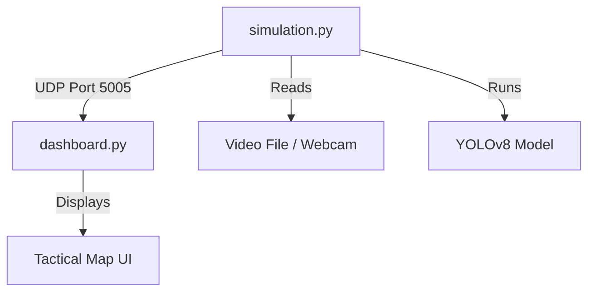

# 👩‍💻 Developer Guide & Code Tour

**Welcome to the Fire Drone Swarm codebase.**
This document explains how the code works, how the components talk to each other, and how to extend it.

---

## 🏗️ System Architecture (The "Simulation")

We are currently in **Phase 0 (Simulation)**. We do not have physical drones yet. Instead, we simulate the system on a single PC using two separate processes.

### 1. The "Drone" (`simulation.py`)
*   **Role:** Simulates the Raspberry Pi 4 flight computer.
*   **What it does:**
    1.  Loads the YOLOv8 AI model.
    2.  Reads frames from a video file (or webcam).
    3.  Runs inference to detect fire.
    4.  **Crucial:** It packs the results (GPS, Fire Status, Confidence) into a JSON packet.
    5.  Sends this packet via **UDP** to `localhost:5005`.
*   **Key Code:** Look at the `while True:` loop. That is the main flight loop.

### 2. The "Base Station" (`dashboard.py`)
*   **Role:** Simulates the Fire Chief's laptop.
*   **What it does:**
    1.  Starts a background thread (`udp_listener`) to listen on Port 5005.
    2.  When a packet arrives, it saves it to `drone_state.json` (acting as a temporary database).
    3.  The main Streamlit loop reads this file and updates the Map and UI.
*   **Key Code:** The `udp_listener` function is the bridge between the drone and the UI.

---

## 📂 File-by-File Explanation

| File | Purpose | Key Libraries |
| :--- | :--- | :--- |
| **`simulation.py`** | The "Backend". Runs the AI and sends telemetry. | `ultralytics`, `cv2`, `socket` |
| **`dashboard.py`** | The "Frontend". Displays the map and alerts. | `streamlit`, `folium` |
| **`yolo_benchmark.py`** | Performance test. Checks if your PC/Pi is fast enough. | `time`, `torch` |
| **`requirements.txt`** | List of all Python packages needed to run this. | N/A |
| **`docs/`** | Documentation folder. | N/A |

---

## 🛠️ How to Extend This

### "I want to add a new sensor (e.g., Battery Voltage)"
1.  **Edit `simulation.py`:** Add `"battery": 95` to the `telemetry` dictionary.
2.  **Edit `dashboard.py`:** Add `st.metric("Battery", state.get("battery", 0))` to the UI.

### "I want to use a real drone"
1.  **Edit `simulation.py`:** Replace `UDP_IP = "127.0.0.1"` with the IP address of your laptop.
2.  **Hardware:** Connect a LoRa module instead of using UDP (Phase 1 task).

---

## 🧪 Testing
*   **Unit Tests:** Currently manual. Run `simulation.py` and see if `dashboard.py` updates.
*   **Performance:** Run `yolo_benchmark.py` to ensure FPS > 1.5.

---

## ❓ Troubleshooting
*   **"Address already in use" error:** You might have the dashboard running twice. Close the terminal and restart.
*   **"Video not found":** Check `VIDEO_PATH` in `simulation.py`.
