# PHASE 1 ARCHITECTURE: Connected Edition (4G/LTE)

**Pivot: From Offline LoRa to Connected 4G.**
**Goal: Real-time control, video streaming, and unlimited range (in coverage).**

---

## THE NEW SYSTEM (4G + Tailscale)

We are replacing the complex custom LoRa radio protocol with standard IP networking over 4G.

```mermaid
graph TB
    subgraph Drone["🚁 DRONE (Edge Node)"]
        D1["Raspberry Pi 4<br/>─────<br/>Tailscale IP: 100.x.y.z<br/>Runs: MavicLink + Video Srvr<br/>Conn: Huawei 4G Dongle"]
    end
    
    subgraph Cloud["☁️ THE INTERNET (Tailscale VPN)"]
        VPN["Tailscale Mesh Network<br/>(Encrypted P2P Tunnel)<br/>NO Public IPs needed<br/>NO Firewall config needed"]
    end
    
    subgraph BaseStation["🏠 BASE STATION (Ground Control)"]
        Laptop["Operator Laptop<br/>─────<br/>Tailscale IP: 100.a.b.c<br/>QGroundControl / Mission Planner<br/>Streamlit Dashboard"]
    end
    
    D1 <-->|4G/LTE| VPN
    VPN <-->|WiFi/Hotspot| Laptop
    
    style Drone fill:#e6ffe6,stroke:#333,stroke-width:2px
    style Cloud fill:#e6f2ff,stroke:#333,stroke-width:2px
    style BaseStation fill:#fff9e6,stroke:#333,stroke-width:2px
```



---

## WHY THE PIVOT?

| Feature | Old (LoRa) | **New (4G Connected)** |
| :--- | :--- | :--- |
| **Range** | 3-5 km (Line of Sight) | **Unlimited** (Cell Coverage) |
| **Data** | Text only ("FIRE FOUND") | **HD Video + Telemetry** |
| **Setup** | Custom Radio Protocol | **Standard TCP/UDP** |
| **Complexity** | High (Hardware radio sync) | **Medium** (Standard Networking) |
| **Cost** | One-time Hardware (€20) | **Recurring Data (~€10/mo)** |

---

## HARDWARE CHANGES

### REMOVE (Save money/weight)
- ❌ **Heltec ESP32 LoRa Modules** (No longer primary comms)
- ❌ **Complex antenna rigging** on drone

### ADD (The Shopping List)
- ✅ **Huawei E3372h-320 4G Dongle** (~€40)
    - *Why this one?* Native Linux support (cdc_ether), works as a network card.
- ✅ **IoT SIM Card** (e.g., Things Mobile / 1NCE / Local Carrier)
    - *Plan:* ~1-5GB data per month.
- ✅ **Tailscale Account** (Free Tier)
    - *Purpose:* VPN Mesh. Allows Pi (behind 4G NAT) to talk to Laptop (behind WiFi NAT) seamlessly.

---

## SOFTWARE STACK

### 1. Connectivity Layer: Tailscale
Everything thinks it's on a local LAN.
- Drone IP: `100.64.0.1`
- Laptop IP: `100.64.0.2`
- **Zero Config:** No port forwarding, no static IPs.

### 2. Telemetry: MAVLink Router
We route MAVLink packets from Pixhawk -> Pi -> UDP Port -> Laptop.
```bash
# On Pi 4
mavlink-routerd -e 100.64.0.2:14550 /dev/ttyACM0:57600
```

### 3. Video: GStreamer / RTSP
Real-time thermal stream over UDP.
```bash
# On Pi 4
gst-launch-1.0 v4l2src ! video/x-raw,width=256,height=192 ! x264enc ! rtph264pay ! udpsink host=100.64.0.2 port=5600
```

### 4. Application: Dashboard
Streamlit dashboard connects to `http://100.64.0.1:8000` (API running on Pi).

---

## UPDATED FLIGHT ESTIMATES

**Reality Check: Flight Time**
With the added weight of the 4G dongle and Pi 4 payload, and the Tarot 650 frame:
- **Maximum Hover Time:** ~18 minutes
- **Safe Mission Time:** **12-15 minutes**
- *Note:* The 60-minute goal is **impossible** with this hardware. It requires a Li-Ion battery pack (custom 18650/21700 cells) and a specialized light-weight endurance frame.

---

## NEXT STEPS (Execution)

1. **Procure 4G Dongle & SIM.**
2. **Install Tailscale** on Pi image (`curl -fsSL https://tailscale.com/install.sh | sh`).
3. **Configure MAVLink Routing** over VPN IP.
4. **Test Video Latency** (Aim for <500ms).
