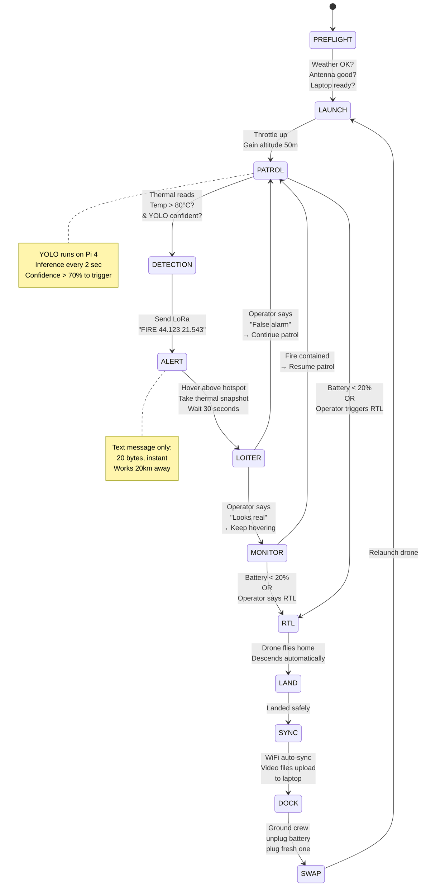

# PHASE 1 ARCHITECTURE: Offline-First, Rat-Rod Edition

**This is what you build NOW (Weeks 1-12). Not Year 3. Not AWS. Not APIs.**

---

## THE SYSTEM (Week 1-12)

```mermaid
graph TB
    subgraph Drones["🚁 DRONES (Edge: YOLO Runs Here)"]
        D1["Drone 1-5<br/>─────<br/>Pi 4<br/>TensorFlow Lite YOLO<br/>Thermal Cam<br/>LoRa SX1276<br/>Onboard Decision:<br/>Temp > 80°C?"]
    end
    
    subgraph Comms["📡 LOCAL WIRELESS"]
        LoRa["LoRa Mesh<br/>868 MHz<br/>5 kbps (text only)<br/>3-20km range<br/>Message format:<br/>FIRE GPS TEMP"]
    end
    
    subgraph BaseStation["🏠 BASE STATION (The Brain = Human)"]
        Laptop["Operator Laptop<br/>─────<br/>Python 3 + Streamlit<br/>SQLite database<br/>Offline maps<br/>Audio alarm"]
        
        LoRaRX["LoRa Ground RX<br/>Heltec ESP32<br/>USB → Laptop"]
        
        Cabinet["Metal Cabinet<br/>─────<br/>Charger<br/>Router (WiFi 5GHz)<br/>Video sync on WiFi<br/>Power strip"]
    end
    
    subgraph LocalStorage["💾 LOCAL STORAGE"]
        DB["SQLite Database<br/>─────<br/>Detection log<br/>Flight times<br/>Battery cycles<br/>Decision log"]
        
        HDD["External HDD 2TB<br/>─────<br/>Video files<br/>Thermal frames<br/>ML training data"]
    end
    
    subgraph Humans["👨‍🚒 HUMAN ORCHESTRATION"]
        Operator["Operator in Van<br/>─────<br/>Watches laptop<br/>Makes decisions:<br/>- Confirm fire?<br/>- Send Drone 2?<br/>- Ground drones?<br/>- RTL when battery low?"]
    end
    
    D1 -->|Step 1:<br/>Reads thermal| D1
    D1 -->|Step 2:<br/>YOLO inference<br/>local (2 sec latency)| D1
    D1 -->|Step 3:<br/>If temp > 80°C<br/>Send text| LoRa
    
    LoRa -->|Step 4:<br/>Receives: FIRE<br/>44.123 21.543 245C| LoRaRX
    LoRaRX -->|Step 5:<br/>USB serial| Laptop
    
    Laptop -->|Step 6:<br/>Beep! Show alert<br/>Red dot on map| Operator
    
    Operator -->|Step 7:<br/>Looks at thermal<br/>frame on laptop<br/>DECIDES: Yes/No?| Laptop
    
    Laptop -->|Step 8:<br/>Log decision| DB
    
    D1 -.->|Step 9 (After landing):<br/>Auto-sync thermal<br/>+ RGB frames| WiFi
    WiFi -.->|Step 10:<br/>Store video files| HDD
    
    HDD -->|Weekly:<br/>Export CSV<br/>for ML training| DB
    
    style Drones fill:#ffe6e6
    style Comms fill:#e6f2ff
    style BaseStation fill:#fff9e6
    style LocalStorage fill:#f0f0f0
    style Humans fill:#e6ffe6
```

---

## WHAT CHANGED FROM MY DIAGRAMS

| Aspect | My Old Design | PHASE 1 (Your Design) |
|--------|---|---|
| **Fire Detection** | Cloud Lambda | **Drone (TensorFlow Lite YOLO)** |
| **Communication** | 4G + LoRa | **LoRa only (no 4G)** |
| **Video Streaming** | Real-time 4G | **Post-flight WiFi sync** |
| **API Gateway** | AWS | **None - everything local** |
| **Orchestration** | Software algorithm | **Human operator** |
| **Database** | S3 bucket | **SQLite on laptop** |
| **Cost** | €500/month AWS | **€0 cloud costs** |
| **Internet Required** | YES | **NO - completely offline** |

---

## THE ACTUAL WIRING DIAGRAM

### What You Plug In (Week 1 Shopping)

```
DRONE (Tarot 650):
┌────────────────────────┐
│                        │
│  Pixhawk 6C (Flight)   │
│  │                     │
│  ├─ GPS module         │
│  ├─ Compass            │
│  └─ IMU (motion)       │
│                        │
│  Raspberry Pi 4        │
│  ├─ USB → InfiRay P2Pro (Thermal Camera)
│  ├─ USB → USB Webcam (RGB - optional, only for post-flight review)
│  ├─ UART TX/RX → Pixhawk (MAVLink telemetry)
│  ├─ SPI → Heltec ESP32 LoRa Module
│  ├─ GPIO 17 → Status LED (blinking = working)
│  └─ USB → Power bank (5V, 2A)
│
│  Heltec ESP32 with LoRa (868 MHz)
│  ├─ SPI pins → Pi 4 (connected)
│  ├─ Antenna → RP-SMA connector (external antenna)
│  └─ USB → Power from Pi
│
│  Battery: 6S 5000mAh
│  └─ → XT90 connector → Power distribution board
└────────────────────────┘

BASE STATION (in Metal Cabinet):
┌────────────────────────┐
│                        │
│  LoRa Ground Unit      │
│  ├─ Heltec ESP32       │
│  ├─ USB → Laptop       │
│  ├─ Antenna → Roof of van (external 868MHz)
│  └─ Power → 12V battery in cabinet
│                        │
│  Laptop (Modern)       │
│  ├─ USB → LoRa RX      │
│  ├─ USB → External HDD 2TB
│  ├─ WiFi → Local router (in cabinet)
│  └─ Power → Cabinet power strip
│                        │
│  Charger (ISDT K4)     │
│  ├─ 4 slots (charge 4 batteries in parallel)
│  ├─ Input: 12V from cabinet battery
│  ├─ Output: 6S LiPo batteries
│  └─ Status: LED lights show charge progress
│                        │
│  Power Distribution    │
│  ├─ 12V car battery (100Ah lead acid, €200)
│  ├─ 220V → 12V converter (if at building with grid)
│  ├─ Breaker (15A)
│  └─ Fused distribution board
│                        │
│  WiFi Router (5GHz)    │
│  ├─ Laptop connects via WiFi
│  ├─ Drones connect when landing (upload video)
│  └─ Manual management (password-protected, WPA3)
└────────────────────────┘
```

**Key Point:** Everything is **USB or power cable**. No API credentials. No cloud logins.

---

## THE STATE MACHINE (Simple)

### All You Need to Know



**That's it. That's the whole system.**

---

## OPERATOR DASHBOARD (Week 5 Code)

Not Streamlit. Not beautiful. Just **functional**.

```python
# dashboard.py - Run on operator's laptop
# Requirements: pip install streamlit folium pyserial

import streamlit as st
import folium
import serial
import json
from datetime import datetime
import sqlite3

st.set_page_config(layout="wide")
st.title("🚁 Fire Detection Drone Swarm - Operator Dashboard")

# Initialize database
conn = sqlite3.connect("detections.db")
cursor = conn.cursor()
cursor.execute("""
    CREATE TABLE IF NOT EXISTS detections (
        id INTEGER PRIMARY KEY,
        timestamp TEXT,
        drone_id TEXT,
        lat REAL,
        lon REAL,
        temp_c REAL,
        operator_decision TEXT
    )
""")
conn.commit()

# ===== RECEIVE LoRa MESSAGES =====
serial_port = serial.Serial('/dev/ttyUSB0', 9600, timeout=1)

col1, col2, col3 = st.columns(3)

with col1:
    st.header("📍 Drone Positions")
    st.text("Drone 1: Patrol Zone A")
    st.text("Drone 2: Patrol Zone B")
    st.text("Drone 3: Battery swap")
    st.text("Drone 4: Patrol Zone C")
    st.text("Drone 5: Patrol Zone D")

with col2:
    st.header("🔋 Battery Status")
    st.text("Drone 1: 65% ⚡")
    st.text("Drone 2: 80% ⚡")
    st.text("Drone 3: CHARGING")
    st.text("Drone 4: 50% ⚠️")
    st.text("Drone 5: 90% ⚡")

with col3:
    st.header("📡 Signal Status")
    st.text("Drone 1: LoRa OK")
    st.text("Drone 2: LoRa OK")
    st.text("Drone 3: Ground (WiFi)")
    st.text("Drone 4: LoRa OK")
    st.text("Drone 5: LoRa OK")

# ===== ALERT =====
st.divider()

# Read LoRa serial (blocking, will beep if message comes)
try:
    line = serial_port.readline().decode('utf-8').strip()
    if line.startswith("FIRE"):
        parts = line.split()
        # Format: FIRE 44.123 21.543 245
        lat, lon, temp = float(parts[1]), float(parts[2]), float(parts[3])
        
        st.error(f"🔥 FIRE ALERT!\nLat: {lat}, Lon: {lon}, Temp: {temp}°C")
        st.audio("alert.wav")  # Play beep sound
        
        col_a, col_b = st.columns(2)
        with col_a:
            if st.button("✅ CONFIRM - Alert Fire Chief"):
                cursor.execute(
                    "INSERT INTO detections VALUES (NULL, ?, ?, ?, ?, ?, ?)",
                    (datetime.now().isoformat(), "Drone-X", lat, lon, temp, "CONFIRMED")
                )
                conn.commit()
                st.success("Fire chief alerted!")
        
        with col_b:
            if st.button("❌ DISMISS - False Positive"):
                cursor.execute(
                    "INSERT INTO detections VALUES (NULL, ?, ?, ?, ?, ?, ?)",
                    (datetime.now().isoformat(), "Drone-X", lat, lon, temp, "FALSE_POSITIVE")
                )
                conn.commit()
                st.info("Logged as training data")

except:
    pass

# ===== MAP =====
st.divider()
st.header("📍 Patrol Map")

m = folium.Map(location=[44.5, 21.5], zoom_start=10)

# Add drone positions
folium.CircleMarker([44.5, 21.5], radius=5, color="blue", popup="Drone 1").add_to(m)
folium.CircleMarker([44.4, 21.6], radius=5, color="blue", popup="Drone 2").add_to(m)

# If fire detected, show it
folium.CircleMarker([44.123, 21.543], radius=10, color="red", popup="🔥 FIRE").add_to(m)

st.folium_static(m)

# ===== DETECTION LOG =====
st.divider()
st.header("📋 Detection Log")

cursor.execute("SELECT * FROM detections ORDER BY timestamp DESC LIMIT 20")
rows = cursor.fetchall()

for row in rows:
    st.text(f"{row[1]} | Drone {row[2]} | {row[3]:.3f}, {row[4]:.3f} | {row[5]}°C | {row[6]}")

conn.close()
```

**That's all.** No AWS. No ML ops. No containers.

---

## YOLO ON THE DRONE (Week 3 Code)

```python
# drone_thermal_detection.py - Runs on Pi 4, detects fire in real-time

import cv2
import numpy as np
from thermal import ThermalCamera
from lora import LoRaMesh
import time

# Load lightweight YOLO model (TensorFlow Lite)
# Uses: yolov8n-int8.tflite (2MB, 2sec inference on Pi 4)
interpreter = tf.lite.Interpreter(model_path="yolov8n-int8.tflite")
interpreter.allocate_tensors()

thermal_cam = ThermalCamera()  # P2Pro via USB
lora = LoRaMesh()  # SX1276 via SPI

while True:
    # Read thermal frame (160×120)
    thermal_frame = thermal_cam.read()
    
    # YOLO inference
    # Input: thermal 160×120
    # Output: bbox, confidence, class
    detections = yolo_infer(thermal_frame, interpreter)
    
    for detection in detections:
        confidence = detection['confidence']
        temp_max = detection['temp']  # From thermal frame
        
        # Decision: Is this a fire?
        if confidence > 0.7 and temp_max > 80:
            # Send alert via LoRa
            gps = read_gps()  # From Pixhawk via MAVLink
            msg = f"FIRE {gps['lat']} {gps['lon']} {int(temp_max)}"
            
            print(f"🔥 Sending: {msg}")
            lora.send(msg)
            
            # Hover and wait for operator decision
            pixhawk.set_mode("LOITER")
            
            # Blink LED to show alert sent
            gpio.blink(17, count=5)
    
    time.sleep(2)  # YOLO inference every 2 sec
```

**That's the detection logic. No cloud calls. No APIs.**

---

## WHAT HAPPENS WHEN OPERATOR DECIDES

### Scenario: Operator Sees Fire Alert

```
LAPTOP:
  Alert: 🔥 FIRE 44.123 21.543 Temp: 245°C (Confidence: 89%)
  Showing thermal frame from Drone 1
  Two buttons:
    [✅ CONFIRM]  [❌ DISMISS]

OPERATOR:
  Looks at thermal
  "That hotspot is real, I can see it in the heatmap"
  Clicks: [✅ CONFIRM]

LAPTOP:
  - Beeps (already beeped, will beep again)
  - Logs to SQLite: "Confirmed by operator at 14:23:45"
  - Displays message: "Fire confirmed. Call fire chief."
  - Stores detection in database

OPERATOR'S NEXT ACTION (Manual):
  Calls fire chief: "We have fire detection at coordinates 44.123, 21.543"
  Fire chief dispatches ground crew
  
OPERATOR'S NEXT ACTION (Drone):
  Types command in terminal:
    $ drone_cmd drone1 "MONITOR"
  
  Drone 1 gets command via LoRa:
    "MONITOR" → Stay hovering, keep thermal stream on
  
  Operator:
    Tells Drone 2 to validate:
    $ drone_cmd drone2 "GO_TO 44.123 21.543 ALTITUDE=100"
  
  Drone 2 breaks patrol, flies to fire location, validates
```

**The operator is the orchestration engine. Just better terminal commands.**

---

## WEEK 1-12 BUILD FOCUS

### WEEK 1-2: Core Loop Works
```
✅ Pi 4 reads InfiRay P2Pro thermal camera
✅ YOLO runs locally, gives confidence
✅ Heltec sends "FIRE GPS TEMP" via LoRa
✅ Ground RX receives on laptop
✅ Laptop shows alert with beep
✅ Operator clicks YES/NO
```

**Not:** Cloud APIs, AWS accounts, authentication, monitoring dashboards

### WEEK 3-4: Drone Flies
```
✅ Tarot 650 assembles and hovers
✅ Pixhawk stable, compass working
✅ LoRa module powered, sending test messages
✅ Thermal camera mounted with vibration dampening
✅ First flight 50m altitude, 5 minutes
```

**Not:** Autonomous approach behavior, multi-drone coordination, fire spread prediction

### WEEK 5-7: Base Station Works
```
✅ Cabinet setup, charger plugged in
✅ Laptop running Streamlit dashboard
✅ LoRa RX antenna tuned (20km range test)
✅ SQLite database saving detections
✅ Battery swap routine practiced (2 min cycle)
```

**Not:** Automated battery management, cloud sync, ML model retraining

### WEEK 8-12: Real Testing
```
✅ Move to forest location
✅ Fly drones 6-8 hours/day
✅ Operator manually manages drones via CLI commands
✅ Collect real fire + false positive data
✅ Write it up for fire department sales
```

**Not:** Fancy orchestration, advanced features, scaling to 10 drones

---

## WHAT'S COMPLETELY CUT (For Now)

❌ **AWS Lambda** - YOLO runs on Pi 4
❌ **S3 buckets** - Files stored on external HDD
❌ **API Gateway** - Operator uses CLI commands
❌ **Automatic orchestration** - Human makes all drone decisions
❌ **Real-time video streaming** - Post-flight WiFi sync only
❌ **Multi-region scaling** - One base station, one team
❌ **ML pipeline** - Manual CSV export for training
❌ **Auto-dock landing** - Manual battery swaps

---

## THE ACTUAL COST (Week 1-12)

```
Hardware:                    €7,340
├─ 5 drones × €1,200        €6,000
├─ Base station             €1,340

Licensing:
├─ EASA A2 certificate      €200
└─ Liability insurance       €2,500

Cloud:                       €0 (offline only!)
├─ AWS                       €0
├─ Data transfer            €0
└─ API calls                €0

TOTAL CAPEX: €7,340
TOTAL OPEX (Year 1): €2,700
**MONTHLY CLOUD COST: €0**

Compare to my design:
  - AWS: €500/month = €6,000/year
  - API Gateway: €0.35/1M requests, but might be 10M/year = €3,500
  - S3: €50/month for video storage

**That's €9,500/year you save by going offline-first.**
```

---

## THE PROMISE: Phase 2 (If You Want It)

After you have 3-5 deployments working offline, THEN:
- Add 4G as backup comms
- Sync data to cloud nightly
- Train YOLO on real data
- Auto-scale to 10 drones
- Sell SaaS dashboard

But **don't build that now.** Build working drones first.

---

## SUMMARY: WEEK 1-12 SYSTEM

| Component | Solution |
|-----------|----------|
| **Detection** | TensorFlow Lite YOLO on Pi 4 (2 sec latency) |
| **Communication** | LoRa 868 MHz mesh (3-20km range, text only) |
| **Operator Interface** | Streamlit dashboard + simple CLI commands |
| **Storage** | SQLite (detections) + external HDD (video) |
| **Orchestration** | Human operator watching alerts |
| **Failsafe** | LoRa link lost → drone auto-RTL |
| **Scaling** | 5 drones + 1 operator = 1 location |
| **Cost** | €7,340 capex, €0 monthly opex |

---

## NEXT STEPS

1. **Burn the old diagrams** (move to `/future_roadmap/`)
2. **Build wiring diagram** (LoRa → Pi 4 → Thermal camera)
3. **Get YOLO working locally** (test on Pi 4)
4. **Build Streamlit dashboard** (basic alert UI)
5. **Fly first drone** (Week 3)
6. **Test LoRa range** (Week 4)
7. **Build base station** (Week 5)
8. **Deploy to forest** (Week 8)

That's it. That's the roadmap.

**No APIs. No cloud. No bloat. Just drones and LoRa and a laptop.**

This is the "rat rod" approach. This is what works.
