# Fire Detection Drone Swarm - System Architecture Diagrams

All diagrams below are in Mermaid format. Copy any section and paste into:
- https://mermaid.live (instant visual)
- Obsidian (native support)
- GitHub markdown (auto-renders)
- PlantUML compatible editors

---

## 1. SYSTEM ARCHITECTURE OVERVIEW
### Where Everything Lives and Talks


**Key Insight:** Drones are "data collectors" not "thinkers". Heavy processing happens in Lambda (cloud) or on operator's laptop.

---

## 2. WHERE DOES PROCESSING HAPPEN?
### Edge vs. Cloud vs. Ground Decision Map

```mermaid
graph LR
    subgraph Edge["🚁 EDGE (On Drone)<br/>─────<br/>Limited CPU"]
        E1["Basic filters<br/>─ Pixel > 100°C?<br/>─ Send alert trigger"]
    end
    
    subgraph Ground["🏠 GROUND (Laptop)<br/>─────<br/>~16GB RAM<br/>Modern CPU"]
        G1["Receive thermal +<br/>RGB streams<br/>─────<br/>Display both to operator<br/>Operator makes decision"]
        G2["Operator Action:<br/>─────<br/>✓ Confirm (real fire)<br/>✗ Dismiss (false positive)<br/>↻ Send another drone"]
    end
    
    subgraph Cloud["☁️ CLOUD (AWS Lambda)<br/>─────<br/>Unlimited compute"]
        C1["Full YOLO inference<br/>─────<br/>Multiple models<br/>Context awareness<br/>Historical trends"]
        C2["ML Training<br/>─────<br/>Retrain models nightly<br/>Improve detection<br/>Reduce false positives"]
    end
    
    E1 -->|Simple threshold| Ground
    Ground -->|Operator decision +<br/>Video evidence| Cloud
    Cloud -->|Improved models| Ground
    Cloud -->|Training data| Cloud
    
    style Edge fill:#ffe6e6
    style Ground fill:#fff9e6
    style Cloud fill:#e6ffe6
```



**Answer to your question:** Detection is **distributed**:
- **Drone:** Basic detection (temperature spike) → triggers alert
- **Ground:** Operator sees thermal + RGB → decides if real fire
- **Cloud:** YOLO model refines future detections

---

## 3. SINGLE DRONE BEHAVIOR TREE
### What One Drone Does (Every Second)

```mermaid
graph TD
    Start["🚁 Drone Flying<br/>Patrol Mode"] -->|Every 1 sec| Thermal["Read Thermal<br/>Frame 160×120"]
    
    Thermal --> CheckTemp{Any pixel<br/>> 100°C?}
    
    CheckTemp -->|NO| RGB["Read RGB<br/>Confirm normal"]
    CheckTemp -->|YES| Alert["🔥 POTENTIAL FIRE<br/>Send alert to ground"]
    
    RGB --> Battery{Battery<br/>> 20%?}
    Alert --> Battery
    
    Battery -->|YES| Continue["Continue patrol<br/>Next frame"]
    Battery -->|NO| RTL["Return to Launch<br/>Land safely"]
    
    Continue -->|Loop| Thermal
    RTL --> Land["Land at base<br/>Power down"]
    
    style Start fill:#fff
    style Alert fill:#ffe6e6
    style RTL fill:#ffcccc
    style Land fill:#ff9999
```



**In current design:** Drone only detects and sends alert. **No adaptive behavior yet.**

---

## 4. ADVANCED FEATURES - ADAPTIVE DRONE BEHAVIOR
### What We SHOULD Add (Multi-Drone Orchestration)

```mermaid
graph TD
    Detection["🔥 Fire Detected<br/>Drone 1 at 44.123, 21.543<br/>Temperature: 245°C<br/>Confidence: 72%"]
    
    Detection --> DecisionHub{"Operator Decision<br/>on Laptop"}
    
    DecisionHub -->|"Dismiss (false+)"| Log1["Log as training data<br/>Continue normal patrol"]
    
    DecisionHub -->|"Confirm but uncertain<br/>Confidence < 80%"| MultiDrone["ORCHESTRATION:<br/>Activate Multi-Drone<br/>Validation Protocol"]
    
    DecisionHub -->|"Confirm<br/>High confidence"| Alert["Alert fire chief<br/>Continue monitoring"]
    
    MultiDrone --> Assign["Assign Drone 2 to:<br/>─ Change altitude<br/>─ Approach at 45° angle<br/>─ Different spectral band<br/>(if thermal fails)"]
    
    Assign --> Position["Drone 2 flies to<br/>Validate from different<br/>perspective"]
    
    Position --> Cross["Cross-validation:<br/>─ Drone 1 thermal: 245°C<br/>─ Drone 2 thermal: 248°C<br/>─ Drone 2 RGB: See flames<br/>─ Consensus: YES REAL FIRE"]
    
    Cross --> HighConfidence["Confidence boosted<br/>to 95%"]
    
    HighConfidence --> AlertChief["ALERT FIRE CHIEF<br/>Location<br/>Dual confirmation<br/>Video evidence"]
    
    AlertChief --> MonitorSpread["Continue monitoring:<br/>─ Track fire edges<br/>─ Watch wind direction<br/>─ Update every 30 sec"]
    
    MonitorSpread --> Spread{Fire expanding<br/>toward structures?}
    
    Spread -->|YES| Escalate["ESCALATE: Call additional<br/>resources to ground"]
    Spread -->|NO| Contain["Contained: Continue<br/>monitoring at 2km altitude"]
    
    style Detection fill:#ffe6e6
    style MultiDrone fill:#fff3cd
    style AlertChief fill:#e6ffe6
    style Cross fill:#e6f2ff
```



**This is NOT in current design but is critical for reducing false positives.**

---

## 5. ORCHESTRATION ENGINE - THE BRAIN
### How Drones Work Together (Intelligence Layer)

```mermaid
graph TB
    subgraph Real["REAL-TIME ORCHESTRATION<br/>──────────────────"]
        O1["Status Monitor<br/>─────<br/>Every drone's:<br/>─ GPS location<br/>─ Battery %<br/>─ Altitude<br/>─ LoRa signal<br/>─ Video quality"]
        
        O2["Fire Detection Handler<br/>─────<br/>When alert arrives:<br/>─ Check confidence score<br/>─ Lookup drone locations<br/>─ Assign nearest drone<br/>  for validation"]
        
        O3["Drone Coordinator<br/>─────<br/>Send commands:<br/>─ 'Drone 2: Go to<br/>  44.123, 21.543'<br/>─ 'Maintain altitude<br/>  100m'<br/>─ 'Send RGB frame<br/>  every 2 sec'"]
    end
    
    subgraph Learning["OFFLINE LEARNING<br/>──────────────────"]
        L1["Nightly Model Update<br/>─────<br/>Collect all detections:<br/>─ Confirmed fires<br/>─ False positives<br/>─ Weather conditions"]
        
        L2["YOLO Model Training<br/>─────<br/>Retrain with labeled data:<br/>─ Real fire examples<br/>─ False positive examples<br/>─ Seasonal adjustments"]
        
        L3["Deploy New Model<br/>─────<br/>Test on validation set<br/>→ If > 95% accuracy<br/>→ Push to Lambda<br/>→ Drones download<br/>  next morning"]
    end
    
    subgraph Rules["DECISION RULES<br/>──────────────────"]
        R1["IF detection confidence > 80%<br/>AND operator confirms<br/>THEN: Alert fire chief<br/>+ Log GPS + Video"]
        
        R2["IF confidence 50-80%<br/>AND nearest drone available<br/>THEN: Send validation drone<br/>+ Wait for cross-check"]
        
        R3["IF confidence < 50%<br/>THEN: Log as data point<br/>+ Flag for training review<br/>+ Don't alert anyone"]
        
        R4["IF multiple drones detect<br/>same location within 1 min<br/>THEN: Confidence *= 1.5<br/>(stronger signal)"]
    end
    
    O1 --> O2
    O2 --> O3
    O3 -->|"Send drone<br/>commands"| Drones["🚁 Drones<br/>Execute"]
    
    Drones -->|"Return video<br/>telemetry"| O1
    
    L1 -->|"Collect data"| Database["Training<br/>Database"]
    Database --> L2
    L2 --> L3
    L3 -->|"Updated model"| O2
    
    O2 --> Rules
    Rules -->|"Apply logic"| O3
    
    style Real fill:#fff9e6
    style Learning fill:#e6ffe6
    style Rules fill:#e6f2ff
```



**Key capability:** Orchestration can:
- ✅ Send validation drone on demand
- ✅ Adjust detection sensitivity by weather
- ✅ Coordinate multiple drones for complex fires
- ✅ Learn from every patrol day
- ❌ NOT YET: Predict fire spread (future feature)

---

## 6. MULTI-DRONE COORDINATION SCENARIOS
### When Do We Use Multiple Drones?

```mermaid
graph TB
    Scenario["Fire Detection System"]
    
    Scenario --> S1["SCENARIO 1:<br/>Low Confidence<br/>Single Detection"]
    S1 --> S1A["Drone 1 detects<br/>245°C hotspot<br/>Confidence: 62%"]
    S1A --> S1B["Operator uncertain<br/>Could be metal roof"]
    S1B --> S1C["Orchestration sends<br/>Drone 2 nearby<br/>To approach at<br/>different angle"]
    S1C --> S1D["Drone 2 confirms<br/>or denies<br/>─────<br/>Consensus decision"]
    
    Scenario --> S2["SCENARIO 2:<br/>High Confidence<br/>Single Detection"]
    S2 --> S2A["Drone 1 detects<br/>350°C flames<br/>RGB shows fire<br/>Confidence: 91%"]
    S2A --> S2B["Operator confirms<br/>IMMEDIATELY"]
    S2B --> S2C["Alert fire chief<br/>Don't wait for<br/>validation"]
    S2C --> S2D["Drone 1 continues<br/>monitoring burn area<br/>Drone 2 circles at<br/>5km distance<br/>watches for spread"]
    
    Scenario --> S3["SCENARIO 3:<br/>Large Wildfire<br/>Multiple Drones"]
    S3 --> S3A["Drones 1,2,3 detect<br/>fire in different<br/>sectors"]
    S3A --> S3B["Orchestration combines<br/>all data:<br/>Fire is ~2 sq km"]
    S3B --> S3C["Assign roles:<br/>─ Drone 1: Monitor<br/>  fire edge<br/>─ Drone 2: Track<br/>  wind direction<br/>─ Drone 3: Watch<br/>  nearby structures"]
    S3C --> S3D["Relay data every<br/>30 seconds to<br/>fire chief"]
    
    Scenario --> S4["SCENARIO 4:<br/>Communication Loss"]
    S4 --> S4A["Drone 1 loses 4G<br/>Falls back to LoRa"]
    S4A --> S4B["Can only send:<br/>'FIRE 44.123 21.543'<br/>(no thermal data)"]
    S4B --> S4C["Drone 2 still has 4G<br/>Flies to location<br/>Validates via RGB"]
    S4C --> S4D["Drone 2 sends<br/>video confirmation<br/>to ground"]
    
    style S1 fill:#fff3cd
    style S2 fill:#e6ffe6
    style S3 fill:#ffe6e6
    style S4 fill:#e6f2ff
```



---

## 7. DATA FLOW - WHERE DATA GOES
### Real Fire Detection Timeline

```mermaid
sequenceDiagram
    participant D1 as Drone 1<br/>Pixhawk+Pi
    participant LoRa as LoRa Mesh
    participant 4G as 4G Modem
    participant Lambda as AWS Lambda<br/>YOLO
    participant Laptop as Operator<br/>Laptop
    participant S3 as S3 Storage<br/>Training Data
    participant Phone as Fire Chief<br/>Phone

    D1->>D1: Read thermal frame<br/>245°C hotspot

    D1->>4G: Stream thermal frame<br/>(160×120, 5 FPS)
    D1->>4G: Stream RGB frame<br/>(1280×720, 10 FPS)
    
    4G->>Laptop: Display thermal<br/>heatmap live
    4G->>Laptop: Display RGB<br/>video live
    
    D1->>Lambda: Send raw thermal<br/>for cloud YOLO
    
    Lambda->>Lambda: Run YOLOv8<br/>inference
    Lambda->>Laptop: Alert: "Potential fire<br/>Confidence: 72%"
    
    Laptop->>Laptop: Beep! Show alert<br/>Ask operator to<br/>confirm/dismiss
    
    alt Operator Confirms
        Laptop->>S3: Log thermal frame<br/>+ RGB frame<br/>+ metadata
        Laptop->>Phone: ALERT: Fire detected!<br/>Lat/Lon: 44.123, 21.543<br/>Video link
        Laptop->>D1: "Continue monitoring<br/>Send update every 30s"
    else Operator Dismisses
        Laptop->>S3: Log as false positive<br/>(for ML training)
    end
```



---

## 8. PROCESSING LOCATION DECISION MATRIX
### Where Should Processing Happen?

```mermaid
graph TB
    subgraph Tasks["Processing Tasks"]
        T1["Read thermal sensor"]
        T2["Read RGB sensor"]
        T3["Simple threshold filter<br/>temp > 100°C"]
        T4["YOLO fire detection"]
        T5["Multi-drone consensus"]
        T6["Fire spread prediction"]
        T7["ML model retraining"]
        T8["Operator visualization"]
    end
    
    subgraph Locations["Where to Process"]
        Edge["🚁 EDGE<br/>On Drone<br/>─────<br/>Pi 4<br/>4GB RAM<br/>Limited CPU<br/>Tight power budget"]
        
        Ground["🏠 GROUND<br/>Operator Laptop<br/>─────<br/>16GB RAM<br/>Modern CPU<br/>Always powered<br/>Human judgment"]
        
        Cloud["☁️ CLOUD<br/>AWS Lambda<br/>─────<br/>Unlimited CPU<br/>GPU available<br/>Persistent storage<br/>ML training"]
    end
    
    T1 -->|Must be| Edge
    T2 -->|Must be| Edge
    
    T3 -->|Light filter| Edge
    T3 -->|Decision| Ground
    
    T4 -->|Option A:<br/>Run on Pi<br/>2 sec latency| Edge
    T4 -->|Option B:<br/>Send to cloud<br/>500ms latency| Cloud
    T4 -->|Decision:<br/>Use cloud<br/>cheaper Pi<br/>better accuracy| Cloud
    
    T5 -->|Coordinate<br/>multi-drone| Ground
    
    T6 -->|Too complex<br/>for drone| Cloud
    
    T7 -->|Massive data<br/>nightly job| Cloud
    
    T8 -->|Where human<br/>sees data| Ground
    
    style Edge fill:#ffe6e6
    style Ground fill:#fff9e6
    style Cloud fill:#e6ffe6
```



**Recommendation:** Current design is **Ground-heavy** (human confirms everything). Could shift to **Cloud-heavy** (auto-alerts with high confidence).

---

## 9. ADVANCED FEATURES MINDMAP
### What We COULD Add (Prioritized)

```mermaid
mindmap
  root((Advanced<br/>Features))
    Multi-Drone
      Validation Protocol
        Closest drone confirms
        Same location
        Different angle
        Consensus voting
      Swarm Behaviors
        Formation flying
        Coordinated search
        Fire perimeter tracking
        Wind-aware positioning
    Adaptive Drone Control
      Intelligent Approach
        Detect → approach 45°
        Read RGB
        Change altitude
        Zoom to hotspot
      Failsafe Recovery
        LoRa lost → RTL
        4G lost → LoRa mode
        Both lost → preprogrammed route
      Battery Optimization
        Extend patrol time
        Smart recharging
        Predictive battery swap
    ML Improvements
      YOLO Fine-tuning
        Train on false positives
        Seasonal adjustments
        Weather-aware model
      Thermal Drift Correction
        Calibrate P2Pro daily
        Temperature offset
        Emissivity adjustment
      Prediction Engine
        Fire spread rate
        Wind impact
        Fuel moisture content
    Orchestration Smarts
      Weather Awareness
        Auto-ground drones
        Wind > 15 knots
        Rain detection
        Optimal patrol times
      Resource Management
        Drone battery tracking
        Charger scheduling
        Optimal rotation
      Incident Escalation
        Auto-call backup
        Alert multiple chiefs
        Share coordinates
        Video real-time
    Integration
      Fire Chief Dashboard
        See drone positions
        Watch live video
        Receive alerts
      Historical Analysis
        Hotspot mapping
        Seasonal trends
        False positive rates
      GDPR Compliance
        Anonymize footage
        Storage limits
        Deletion policies
```



---

## 10. SYSTEM ARCHITECTURE (Simplified Block Diagram)

```mermaid
graph TB
    subgraph Drones["DRONE LAYER<br/>─────────────────"]
        Thermal["Thermal Camera<br/>(P2Pro)"]
        RGB["RGB Camera<br/>(USB webcam)"]
        Pi["Raspberry Pi 4<br/>(Coordinator)"]
        Pixhawk["Pixhawk 6C<br/>(Flight control)"]
        Comms["LoRa + 4G"]
    end
    
    subgraph Network["NETWORK LAYER<br/>─────────────────"]
        LoRaMesh["LoRa Mesh<br/>(868 MHz)"]
        Cellular["4G/5G<br/>(Primary)"]
    end
    
    subgraph Ground["GROUND STATION<br/>─────────────────"]
        UI["Web Dashboard<br/>(Browser)"]
        Storage["Local Storage<br/>(HDD)"]
        Operator["Operator<br/>(Human)"]
    end
    
    subgraph Cloud["CLOUD LAYER<br/>─────────────────"]
        YOLO["YOLO Model<br/>(Fire detection)"]
        Database["Training Data<br/>Repository"]
        API["REST API<br/>(Coordination)"]
    end
    
    subgraph Alert["ALERT SYSTEM<br/>─────────────────"]
        FireChief["Fire Chief<br/>Notification"]
    end
    
    Thermal -->|Raw data| Pi
    RGB -->|Raw data| Pi
    Pi -->|Commands| Pixhawk
    Pixhawk -->|Telemetry| Pi
    
    Pi -->|Video streams| Comms
    Comms -->|Primary| Cellular
    Comms -->|Backup| LoRaMesh
    
    Cellular -->|Streams| Ground
    LoRaMesh -->|Alerts| Ground
    
    Ground -->|Operator sees| UI
    UI -->|Operator decides| Operator
    Ground -->|Stores locally| Storage
    
    Ground -->|Sends to cloud| Cloud
    Cloud -->|Inference| YOLO
    YOLO -->|Feedback| Cloud
    Cloud -->|API calls| Ground
    
    Ground -->|Confirmed fire| FireChief
    Cloud -->|Auto-alert<br/>if high confidence| FireChief
    
    style Drones fill:#ffe6e6
    style Network fill:#e6f2ff
    style Ground fill:#fff9e6
    style Cloud fill:#e6ffe6
    style Alert fill:#ffcccc
```



---

## 11. INTELLIGENT DRONE RESPONSE TREE
### How Should Drone Respond to Detection?

```mermaid
graph TD
    Start["Drone detects<br/>potential fire<br/>Temp: 200-300°C"]
    
    Start --> Decision1{Confidence<br/>threshold<br/>met?}
    
    Decision1 -->|NO| Ignore["Ignore<br/>Continue patrol<br/>Log data point"]
    
    Decision1 -->|YES| SendAlert["Send alert to ground<br/>Include: GPS, Temp,<br/>RGB frame"]
    
    SendAlert --> WaitDecision{"Wait for<br/>operator<br/>decision<br/>5 seconds"}
    
    WaitDecision -->|DISMISS| Cancel["Cancel adaptive<br/>behavior<br/>Resume patrol"]
    
    WaitDecision -->|CONFIRM| Adaptive["🎯 ADAPTIVE BEHAVIOR<br/>─────────────────"]
    
    WaitDecision -->|NO RESPONSE<br/>5+ sec timeout| Adaptive
    
    Adaptive --> A1["Step 1: Approach<br/>─────<br/>Reduce altitude 10m<br/>Change angle 45°<br/>Zoom to hotspot"]
    
    A1 --> A2["Step 2: Validate<br/>─────<br/>Read RGB frame<br/>Confirm fire<br/>Update confidence"]
    
    A2 --> A3["Step 3: Position<br/>─────<br/>Hover above hotspot<br/>30m altitude<br/>Track fire edges"]
    
    A3 --> A4["Step 4: Report<br/>─────<br/>Send updated<br/>thermal + RGB<br/>every 30 sec<br/>to ground"]
    
    A4 --> Monitor["Continue monitoring<br/>─────<br/>Update fire extent<br/>Watch for spread<br/>Battery alert at 20%"]
    
    Monitor --> Battery{Battery<br/>critical?}
    
    Battery -->|YES| RTL["Return to Launch<br/>Switch to Drone 2<br/>for continued monitoring"]
    
    Battery -->|NO| Monitor
    
    Ignore --> Loop["Next patrol cycle"]
    Cancel --> Loop
    RTL --> Loop
    
    style Adaptive fill:#fff3cd
    style RTL fill:#ffcccc
```



---

## 12. ORCHESTRATION STATE MACHINE
### What Orchestration Engine Can Do


---

## SUMMARY TABLE: What Happens Where

| **Action** | **Where** | **By Whom** | **Output** |
|---|---|---|---|
| Read sensors | Drone | Pixhawk/Pi | Thermal frame, RGB frame |
| Basic threshold | Drone | Pi script | "Temp > 100°C?" |
| Send alert | Drone | Pi via 4G/LoRa | Raw data to ground |
| **YOLO detection** | **Cloud** | **Lambda** | **Confidence score** |
| **Operator confirm** | **Ground** | **Human** | **Decision: YES/NO** |
| Adaptive approach | Drone | Pixhawk (commanded) | New position, new data |
| Cross-validation | Drone 2 | Same process | Validation result |
| Fire chief alert | Cloud API | Orchestration | GPS + video link + alert |
| ML retraining | Cloud | Scheduled job | New YOLO model |
| Dashboard display | Ground | Browser | Live thermal + RGB view |
| Data storage | S3 | Lambda | Training dataset |

---

## YOUR SPECIFIC QUESTIONS ANSWERED

### Q1: "Does drone detect or processing elsewhere?"
**Answer:** Hybrid approach
- **Drone detects:** Basic threshold (temp > 100°C) → sends raw data
- **Cloud processes:** YOLO inference on thermal + RGB → returns confidence
- **Ground decides:** Operator sees both streams → makes final call

### Q2: "Can drone come closer, change angles, multi-drone validation?"
**Answer:** YES, but NOT in current design. This is **Scenario 2-3 above** (adaptive behavior tree).
```
Current: Drone sends alert → operator sees streams → decides
Better:  Drone sends alert → operator says "validate" 
         → Drone approaches 45° angle, hovers, reads RGB
         → Sends confirmation → operator more confident
         → Can send Drone 2 for cross-check
```

### Q3: "How does orchestration work?"
**Answer:** See **State Machine diagram (12)** above.
- Listens for alerts from all drones
- Evaluates confidence (YOLO score + human input)
- Makes decisions:
  - High conf → Alert fire chief NOW
  - Med conf → Send validation drone
  - Low conf → Log for training, don't alert
- Tracks fire spread
- Escalates if needed

### Q4: "What's most useful orchestration?"
**Answer:** Multi-drone validation (Scenario 1 in diagram 6)
```
Benefit:
- Reduces false positives from 30% to <5%
- Operator sees 2+ drone perspectives
- High confidence = faster response
- Consensus = legal defensibility

Cost: One extra drone flying 5-10 min for validation
Trade-off: Worth it
```

---

## NEXT STEPS

1. **Copy any diagram** → paste into https://mermaid.live
2. **See visual** → understand system flow
3. **Identify gaps** → "Should drone do X?" or "Can ground handle Y?"
4. **Iterate design** → modify diagram → repeat

**Most important diagram for you:**
- **#2** (Processing location) - Clarifies who thinks where
- **#4** (Adaptive features) - Shows what drone COULD do
- **#5** (Orchestration) - Explains multi-drone coordination
- **#12** (State machine) - Shows decision logic
